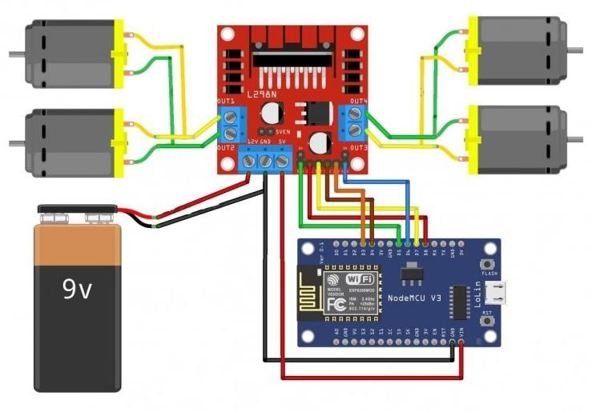
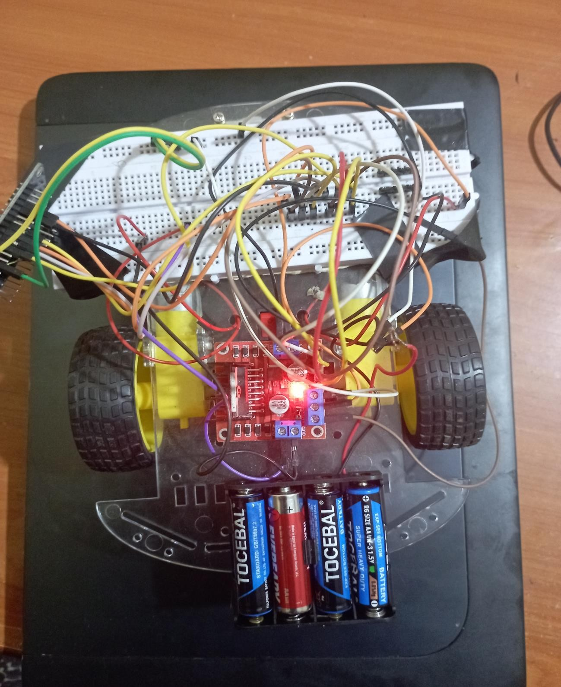
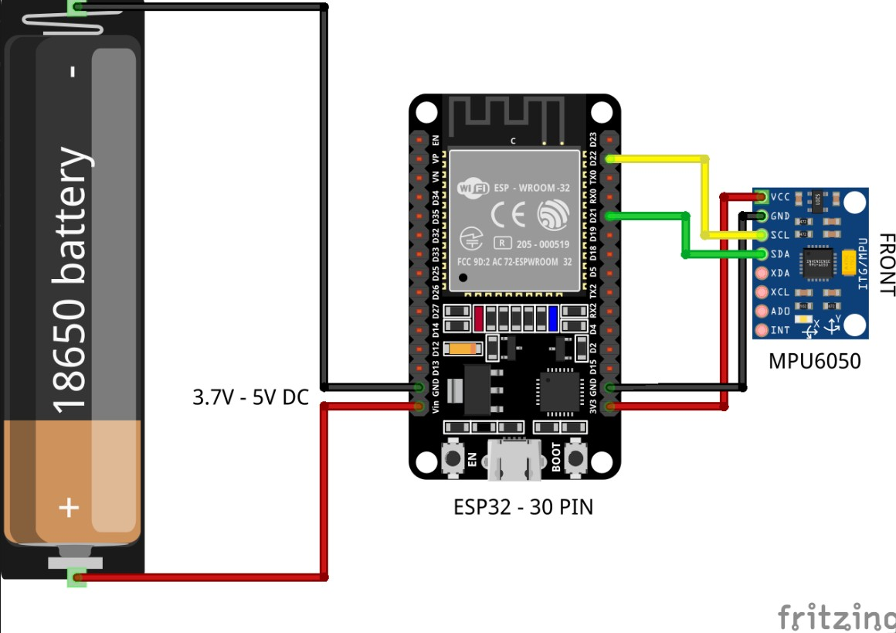
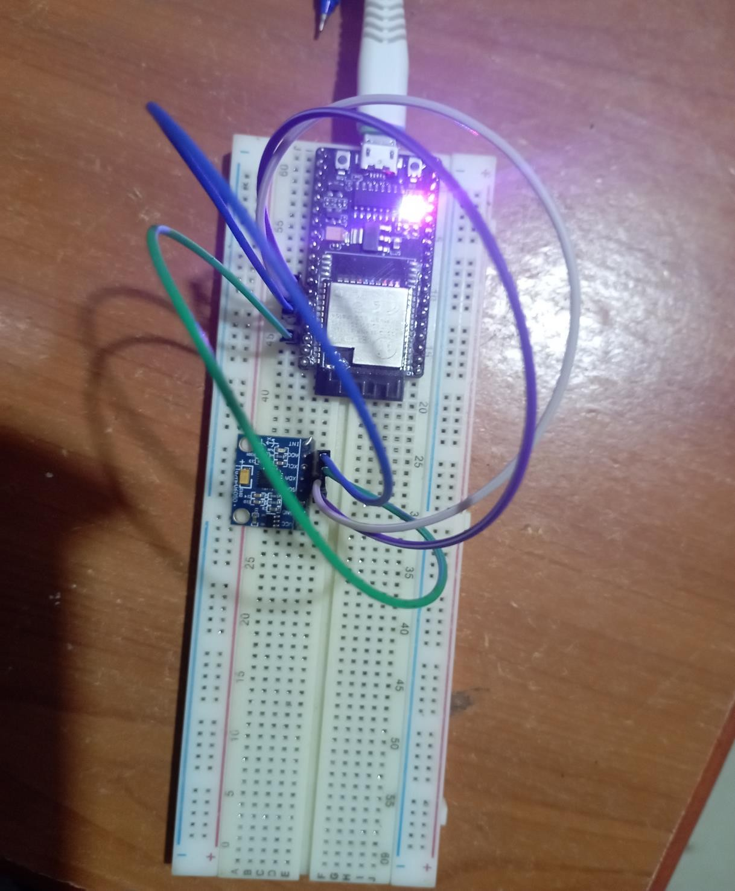
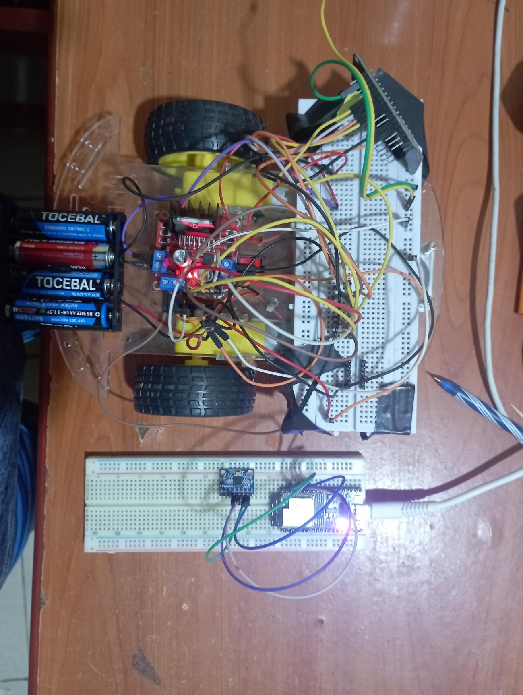
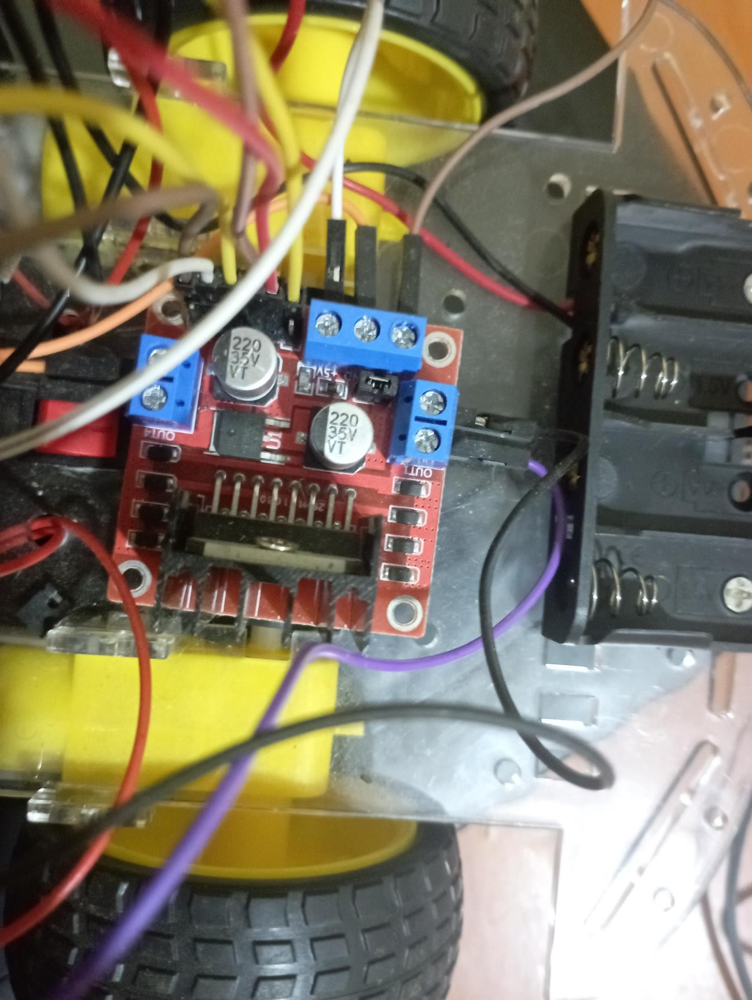

# Gesture-Controlled Robot using Arduino, MPU6050, and ESP32

## Introduction

Robot cars, including gesture-controlled models, represent a remarkable fusion of cutting-edge technology and automation. These vehicles are often powered by microcontrollers like the Arduino Uno, serving as the brains behind their operation. Arduino Uno's versatility enables precise control and coordination of various components in robotic systems. In the context of gesture-controlled cars, Arduino Uno processes data from sensors like accelerometers and gyroscopes, interpreting user gestures in real-time and translating them into actionable commands for the vehicle. This integration opens up exciting possibilities, from educational tools to entertainment devices, providing a glimpse into the future of human-robot interaction and autonomous vehicles.

## How It Works

In this project, we're building a gesture-controlled robot using Arduino, the MPU6050 accelerometer and gyroscope, and ESP32. The system comprises a Transmitter (MPU6050 sensor and ESP32 module) and a Receiver (Arduino Uno, ESP8266 module, two DC motors, and an L293D motor driver). The Transmitter sends continuous data to the Receiver, which processes the gestures and controls the robot's movement accordingly.

### Transmitter

- MPU6050 accelerometer sends data to ESP32.
- ESP32 transmits data to the Receiver.

### Receiver

- ESP8266 accepts and processes transmitted data.
- Motor driver controls robot movement based on user gestures.

## Circuit Diagrams

### Receiver

- **Circuit Diagram:**
  

- **Realized Circuit:**
  

### Transmitter

- **Circuit Diagram:**
  

- **Realized Circuit:**
  

### Both Transmitter and Receiver

- **Combined Circuit:**
  

- **Motor Driver:**
  

## Discussion

### Observations

1. **Communication Efficiency:**
    - The use of ESP32 modules in the Transmitter greatly improved communication efficiency, ensuring reliable and quick data transmission.

2. **Role of ESP8266:**
    - ESP8266 on the Receiver side played a crucial role in interpreting gestures and instructing the motor driver.

3. **Integration Challenges:**
    - Integration of multiple components presented challenges in calibration and synchronization, requiring careful tuning.

4. **Real-time Responsiveness:**
    - Continuous data flow showcased the real-time responsiveness crucial for an intuitive user experience.

5. **Motor Control Precision:**
    - The L293D motor driver, influenced by the ESP8266, demonstrated precise control over DC motors, translating gestures into fluid movements.

## Conclusion

The project successfully demonstrated the potential of gesture control in robotics, leveraging Arduino, MPU6050, and ESP32 technologies. Challenges during integration highlighted areas for improvement, while real-time responsiveness and motor control precision provide a solid foundation for expanding the capabilities of gesture-controlled robots.

## References

1. Adarsh Kumar. (2018). "Gesture Controlled Robot Using Accelerometer and Gyroscope."
2. [Electromaker Project - Make Wi-Fi Controller Car using ESP8266](https://www.electromaker.io/project/view/make-wi-fi-controller-car-using-esp8266)

## License

This project is licensed under my License - see the [LICENSE](LICENSE) file for details.